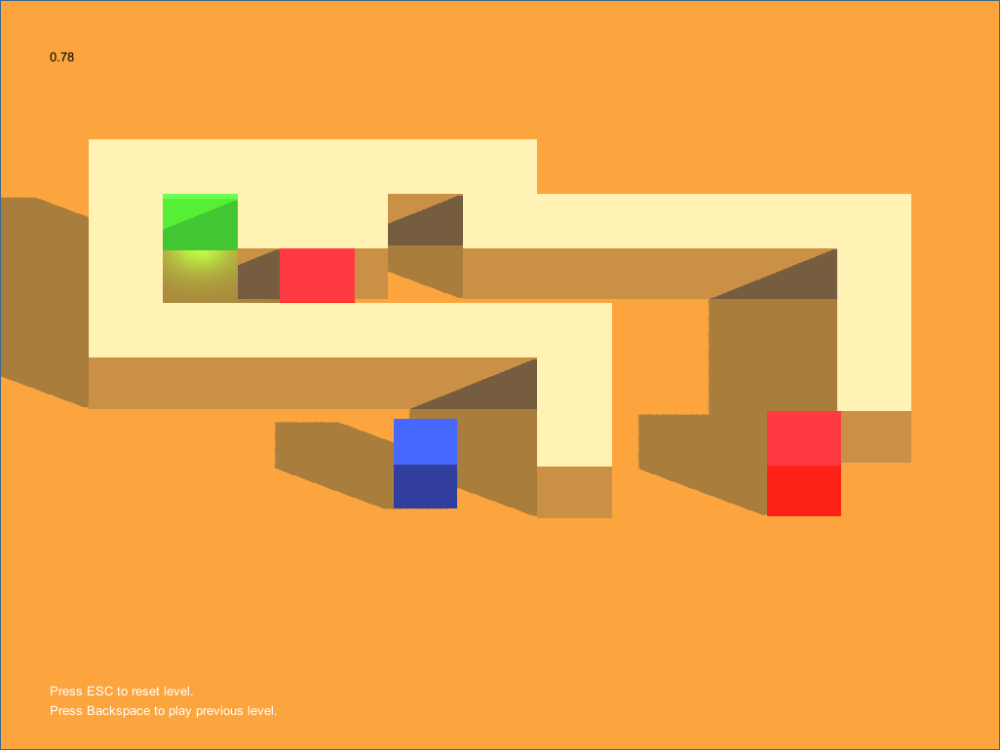

# game-a-week-one
by [@JonRaem](https://twitter.com/JonRaem/)

<h2> Background </h2>

 Back in the autumn of 2014 I decided to start a Game A Week project to improve my skills in game development. What is a Game A Week, you ask? It's pretty self explanatory: you have to make a game in a week and release it on the last day no matter what. This teaches not only working under a time constraint but also how to start, work on and finish a project within said time constraint. My project consisted of five parts and this is the first installment to it. 

 <strong>CubeMaze</strong> is a simple 3D maze with cubes and a timer! It has three levels and an ortographic view for style. This was my first Game A Week release and I made it with the help of a YouTube tutorial. To play the game you simply need to guide the blue cube through the maze to the glowing green goal with <code>WASD</code> or <code>arrow keys</code> without touching the red cubes. 

<h2> Installation </h2>
<ol>
  <li> To play this game, you must install Unity3D game engine from https://unity3d.com/. </li>
  <li> After you have installed the game engine, run the .exe file found in the root folder of the project to play the game. </li>
</ol>

---

